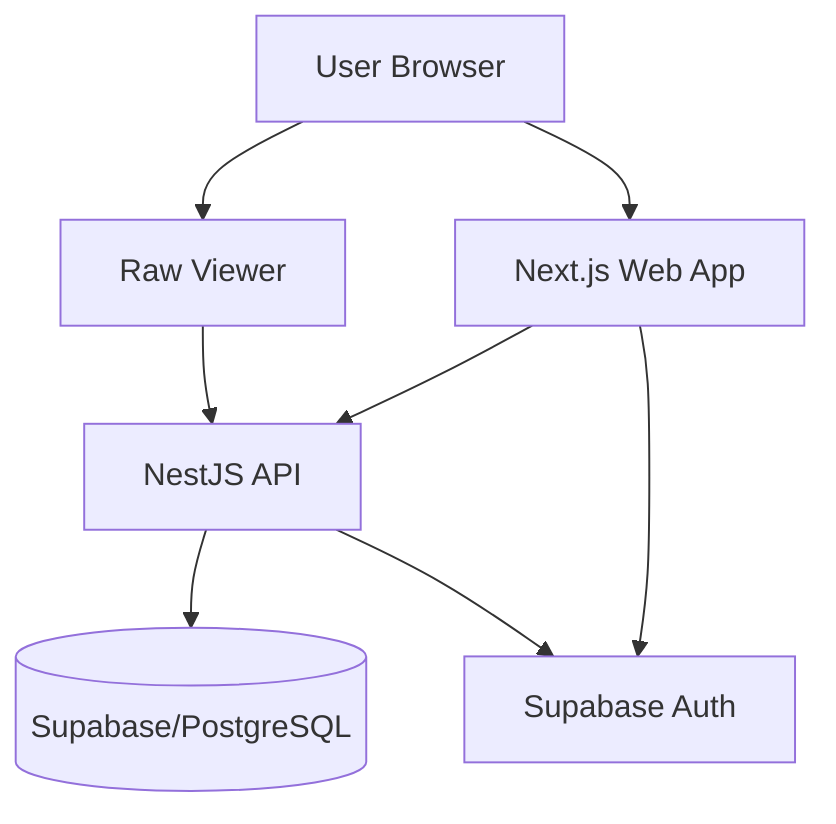
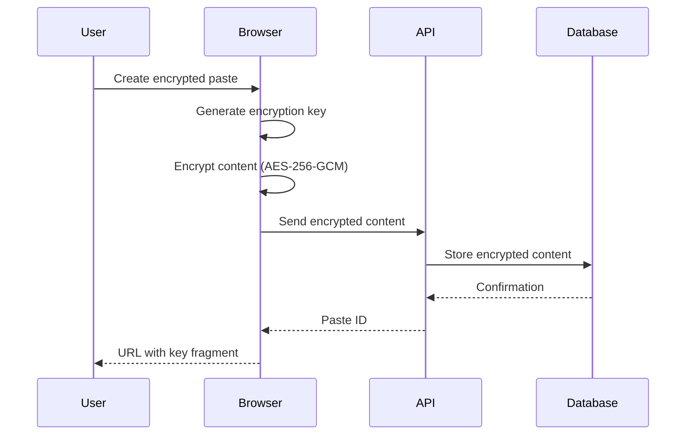
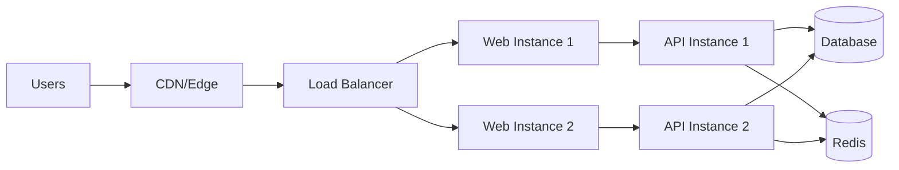

# Architecture

This document provides an overview of psti.io's architecture, design decisions, and technical implementation.

## System Architecture

psti.io is built as a **monorepo** using Turborepo, containing multiple applications and shared packages.



## Monorepo Structure

### Applications (`apps/`)

#### Web App (`apps/web`)
- **Framework:** Next.js 16 with App Router
- **Purpose:** Main user interface
- **Features:**
  - Paste creation and management
  - User authentication
  - Dashboard and organization
  - Monaco editor integration

#### API (`apps/api`)
- **Framework:** NestJS
- **Purpose:** Backend REST API
- **Features:**
  - Paste CRUD operations
  - User management
  - Authentication and authorization
  - Rate limiting
  - Audit logging

#### Raw Viewer (`apps/raw`)
- **Framework:** Next.js (minimal)
- **Purpose:** Clean paste viewing
- **Features:**
  - Distraction-free paste display
  - Syntax highlighting
  - Direct paste access

#### Docs (`apps/docs`)
- **Framework:** Next.js with MDX
- **Purpose:** Documentation site
- **Features:**
  - User guide
  - Developer documentation
  - API reference

### Packages (`packages/`)

#### Database (`@psti/database`)
- Supabase client configuration
- Database types and schemas
- Migration management

#### UI (`@psti/ui`)
- Shared React components
- shadcn/ui component library
- Tailwind CSS configuration

#### Auth (`@psti/auth`)
- Authentication utilities
- JWT handling
- Session management

#### Validation (`@psti/validation`)
- Zod schemas
- Input validation
- Type-safe validation

#### Security (`@psti/security`)
- Encryption utilities (AES-256-GCM)
- Input sanitization
- Security headers

#### Types (`@psti/types`)
- Shared TypeScript types
- API contracts
- Database types

#### Config (`@psti/config`)
- Shared configuration
- Environment variables
- Constants

## Technology Stack

### Frontend

| Technology | Purpose |
|------------|---------|
| Next.js 16 | React framework with App Router |
| React 19 | UI library |
| TypeScript | Type safety |
| Tailwind CSS | Styling |
| shadcn/ui | Component library |
| Monaco Editor | Code editor |
| Zod | Validation |

### Backend

| Technology | Purpose |
|------------|---------|
| NestJS | Node.js framework |
| Supabase | Database and auth |
| PostgreSQL | Database |
| JWT | Authentication |
| Throttler | Rate limiting |
| Helmet | Security headers |

### Infrastructure

| Technology | Purpose |
|------------|---------|
| Turborepo | Monorepo build system |
| npm | Package manager |
| ESLint | Linting |
| Prettier | Code formatting |

## Data Model

### Core Entities

#### Pastes

```typescript
interface Paste {
  id: string;
  title: string | null;
  content: string;
  language: string | null;
  visibility: 'public' | 'unlisted' | 'private';
  password_hash: string | null;
  encrypted: boolean;
  burn_after_read: boolean;
  expires_at: Date | null;
  user_id: string | null;
  folder_id: string | null;
  views: number;
  created_at: Date;
  updated_at: Date;
}
```

#### Users

```typescript
interface User {
  id: string;
  email: string;
  role: 'user' | 'admin';
  created_at: Date;
  updated_at: Date;
}
```

#### Folders

```typescript
interface Folder {
  id: string;
  name: string;
  user_id: string;
  created_at: Date;
}
```

## Security Architecture

### Defense in Depth

psti.io implements multiple layers of security:

1. **Application Layer**
   - Input validation and sanitization
   - CSRF protection
   - XSS prevention
   - Rate limiting

2. **Authentication Layer**
   - JWT-based authentication
   - Secure password hashing (bcrypt)
   - Email verification
   - Session management

3. **Database Layer**
   - Row-Level Security (RLS)
   - Prepared statements
   - Encrypted connections

4. **Transport Layer**
   - HTTPS enforcement
   - Secure headers (HSTS, CSP)
   - Certificate pinning

### Encryption Flow



### Row-Level Security

All database tables have RLS policies:

```sql
-- Users can only view their own private pastes
CREATE POLICY "Users can view own private pastes"
ON pastes FOR SELECT
USING (
  visibility != 'private' OR 
  auth.uid() = user_id
);

-- Users can only update their own pastes
CREATE POLICY "Users can update own pastes"
ON pastes FOR UPDATE
USING (auth.uid() = user_id);
```

## API Design

### RESTful Principles

- **Resource-based URLs:** `/api/pastes/:id`
- **HTTP methods:** GET, POST, PATCH, DELETE
- **Status codes:** Proper use of 2xx, 4xx, 5xx
- **JSON responses:** Consistent response format

### Response Format

```typescript
{
  success: boolean;
  data?: any;
  error?: {
    message: string;
    code: string;
  };
}
```

### Authentication

```
Authorization: Bearer <jwt-token>
```

## Build System

### Turborepo

Turborepo orchestrates builds across the monorepo:

```json
{
  "pipeline": {
    "build": {
      "dependsOn": ["^build"],
      "outputs": [".next/**", "dist/**"]
    },
    "dev": {
      "cache": false,
      "persistent": true
    },
    "lint": {
      "outputs": []
    }
  }
}
```

### Benefits

- **Incremental builds** - Only rebuild changed packages
- **Remote caching** - Share build cache across team
- **Parallel execution** - Build multiple packages simultaneously
- **Task dependencies** - Automatic dependency resolution

## Performance Optimizations

### Frontend

- **Code splitting** - Automatic with Next.js
- **Image optimization** - Next.js Image component
- **Font optimization** - Next.js Font optimization
- **Static generation** - Pre-render where possible
- **Edge caching** - CDN for static assets

### Backend

- **Database indexing** - Indexes on frequently queried columns
- **Connection pooling** - Supabase connection pooler
- **Query optimization** - Efficient SQL queries
- **Caching** - Redis for session and rate limiting

### Database

```sql
-- Indexes for performance
CREATE INDEX idx_pastes_user_id ON pastes(user_id);
CREATE INDEX idx_pastes_created_at ON pastes(created_at);
CREATE INDEX idx_pastes_visibility ON pastes(visibility);
```

## Scalability Considerations

### Horizontal Scaling

- **Stateless API** - Can run multiple instances
- **Database pooling** - Handle concurrent connections
- **CDN** - Distribute static assets globally
- **Load balancing** - Distribute traffic across instances

### Vertical Scaling

- **Database optimization** - Efficient queries and indexes
- **Caching** - Reduce database load
- **Asset optimization** - Minimize bundle sizes

## Design Decisions

### Why Monorepo?

- **Code sharing** - Easy to share types, utilities, components
- **Atomic changes** - Update API and frontend together
- **Consistent tooling** - Single ESLint, TypeScript config
- **Simplified dependencies** - One package.json to rule them all

### Why Next.js?

- **App Router** - Modern React patterns
- **Server Components** - Better performance
- **Built-in optimization** - Images, fonts, code splitting
- **Great DX** - Fast refresh, TypeScript support

### Why NestJS?

- **TypeScript-first** - Type safety throughout
- **Modular architecture** - Easy to organize code
- **Dependency injection** - Testable code
- **Decorators** - Clean, declarative code

### Why Supabase?

- **PostgreSQL** - Powerful, reliable database
- **Built-in auth** - No need to build from scratch
- **Row-Level Security** - Database-level authorization
- **Real-time** - WebSocket support (future feature)

## Testing Strategy

### Unit Tests
- Individual functions and utilities
- Business logic
- Validation schemas

### Integration Tests
- API endpoints
- Database operations
- Authentication flows

### E2E Tests
- Critical user flows
- Paste creation and viewing
- Authentication

## Deployment Architecture



## Future Considerations

- **Real-time collaboration** - Multiple users editing same paste
- **WebSocket support** - Live updates
- **GraphQL API** - Alternative to REST
- **Microservices** - Split API into smaller services
- **Kubernetes** - Container orchestration

## Next Steps

- [Set up your environment](/developer-guide/setup)
- [Learn how to contribute](/developer-guide/contributing)
- [Explore the API](/api-reference)
